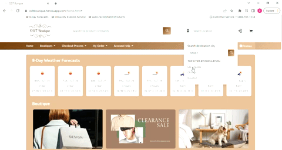

# **ODT boutique project** 

Modern e-commerce platforms such as Shopify, BigCommerce, WooCommerce, Magento, etc., have been systematic and mature. This project is a webpage that can implant into any mature commercial website or affiliate marketing program. This project combines geographical location, latitude, and longitude with the weather forecasts. Users search for products on a regular commercial website or input a city name/zip code to check weather forecasts in the entire USA. Then the website can automatically recommend fashion products or accessories that match local weather and temperature to users. These search results, combined with boutique high-end brands and city information, create a different consumption experience, and improve revenue for merchants.

**Link to project:** https://odtboutique.herokuapp.com/

## How It's Made:

**Tech used:** The front-end build uses HTML, CSS, bootstrap, and JavaScript; the back-end build uses Node.js, Express, and MongoDB. The cloud platform uses Heroku.

The main design of this project is on the first webpage while retaining the basic page design of e-commerce. It has the self-create products API (product information is from high-end brand websites, contents have been modified and designed), also refers to the third-party API from https://openweathermap.org/, One Call API 3.0, and Geocoding API. 

## Optimizations

**Inventory feature:** 

The database has set schema support location and products inventory; for example, when the user clicks or inputs city New York and product name, it will display how many products left over in the closest store location near New York City. 

**Sort feature:** 

Product recommendation depends on the vendor’s contract, commission, revenue history tracking, etc. The database design supports front-end deploy products sort; for example, the company with vendor ABC brand have a good relationship. ABC brand products are always on the first contain in products secession. 

**Pay method back-end design** 

Pay method back-end design in the real-world use stripe. 

Refer to the website link: https://stripe.com/payments/features.

## Lessons Learned:

·         Error messages: ‘osacript’ is not recognized as an internal or external command error in the windows operating system; it may be because it didn’t save the database in the local machine that caused this issue. 

·         When a project is completed, you may face another challenge: uploading your project to the platform successfully, so always organizing the code is super important.

## Examples:

Take a look at these couple examples that I have in my own portfolio:

**ERNO LASZLO Friends & Family Event :** https://springevent.netlify.app/

**ERNO LASZLO Brand Ambassador :** https://brandambassadorlaszlo.netlify.app/

**look4city.com:** https://look4cityinfo.netlify.app/